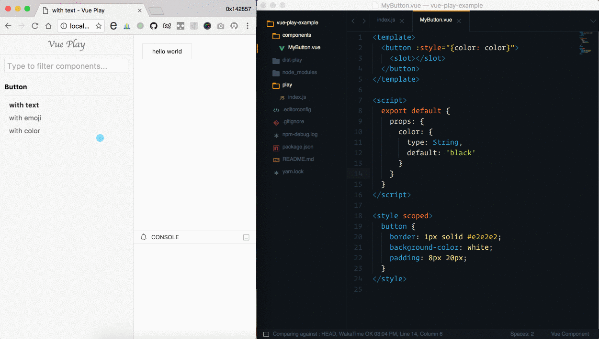

# vue-play

[](https://npmjs.com/package/vue-play) [](https://npmjs.com/package/vue-play) [](https://circleci.com/gh/vue-play/vue-play) [](https://gitter.im/vue-play/vue-play)

A minimalistic framework for demonstrating your Vue components, inspired by [react-storybook](https://github.com/kadirahq/react-storybook).



## Table of Contents

<!-- toc -->

- [Getting Started](#getting-started)
- [Writing Scenarios](#writing-scenarios)
  * [Keeping Scenarios](#keeping-scenarios)
  * [Writing Scenarios](#writing-scenarios-1)
  * [Loading Scenarios Dynamically](#loading-scenarios-dynamically)
  * [Register Components](#register-components)
  * [Use Component as `play()` argument](#use-component-as-play-argument)
- [Component Shorthand](#component-shorthand)
- [Additional Component Properties](#additional-component-properties)
  * [example](#example)
  * [readme](#readme)
- [Component Injection](#component-injection)
  * [this.$log(data)](#thislogdata)
- [Showcase](#showcase)
- [Development](#development)
- [License](#license)

<!-- tocstop -->

## Getting Started

Integrate `vue-play` into your project using [get-play](https://github.com/vue-play/getplay):

```bash
yarn global add getplay
cd my-project
getplay
```

Then you can run `yarn play` and go to `http://localhost:5000`

So far we got:

- npm scripts `yarn play` & `yarn build:play`
- A `./play` folder where you write scenarios for your component
- A `./play.config.js` file which helps you configure webpack easily using [vbuild](https://vbuild.js.org)


The only thing you really need to worry about is `./play/index.js`, since you will write scenarios or dynamically load scenarios there.

## Writing Scenarios

`scenario`, a.k.a. story in react-storybook, it's usually an example component for demostrating your real component.

### Keeping Scenarios

You can keep scenarios anywhere you want, by default keep them all at `./play/index.js`, you can also use separate files for them, or even name them `*.play.js` in your component directory and load them dynamically.

### Writing Scenarios

```js
import { play } from 'vue-play'
import MyButton from '../src/components/MyButton.vue'

// Use `play` to describe component title
// use .add to add scenario for that component
play('MyButton')
  .add('with text', h => h(MyButton, ['hello world']))
  .add('with emoji', h => h(MyButton, ['😃🍻']))
```

### Loading Scenarios Dynamically

We can use Webpack's [require.context](https://webpack.github.io/docs/context.html#require-context) to load modules dynamically.

```js
const load = requireContext => requireContext.keys().map(requireContext)

// load files which end with `.play.js` in `../src/components` folder
load(require.context('../src/components', true, /.play.js$/))
```

### Register Components

If you are using render function you won't need to register components, you only need this when you are using the template property, and it's same way as you do in other Vue app:

```js
// ./play/index.js
import Vue from 'vue'
import MyButton from './MyButton.vue'

// register globally
Vue.component('my-button', MyButton)

play('MyButton')
  .add('with text', {
    template: '<my-button>text</my-button>'
  })
```

You can also [register components locally](https://vuejs.org/v2/guide/components.html#Local-Registration).

### Use Component as `play()` argument

```js
import MyButton from './MyButton.vue'

// assuming MyButton.name is 'my-button'
play(MyButton)
  // MyButton will be automatially registered in scenarios
  // so you don't have to register it again
  .add('with text', '<my-button></my-button>')

// then the app sidebar will look like:
// - my-button
//    - with text
```

To customize the `displayName` in sidebar and the `componentName` which is used to register itself in scenarios, you can simply set them in your component:

```vue
<!-- ./MyButton.vue -->
<script>
  export default {
    name: 'my-other-button',
    displayName: 'Show off my cute button'
  }
</script>
```

Or use methods:

```js
play(MyButton)
  .name('my-other-button')
  .displayName('Show off my cute button')
  .add('with text', '<my-other-button>text</my-other-button>')
```

## Component Shorthand

If you only need `template` or `render` property for your component, you can use `component shorthand`, which means you can directly set the value of scenario to a template string or render function:

```js
import Example from './Example.vue'
play('Button')
  .add('template shorthand', '<my-button>text</my-button>')
  .add('render function shorthand', h => h(MyButton, ['text']))
  .add('full component', {
    data() {},
    methods: {},
    render(h) {}
    // ...
  }).
  .add('single file', Example)
```

**note:** If you are using `template` shorthand or `template` property in component options, you should use [Vue standalone build](https://vuejs.org/guide/installation.html#Standalone-vs-Runtime-only-Build) as well. For `vue-play-cli`, it's as simple as using `--standalone` option.

## Additional Component Properties

The component for each scenario is a typical Vue component, but it can also accept some additional properties for documenting its usage, eg:

```js
play('Button')
  .add('with text', {
    // a valid vue component
    ...component,
    // additional
    example,
    // ...
  })
```

### example

Type: `string`

The example code of your component.

### readme

Type: `HTML string`

Optionally display a readme tab to show detailed usage.

## Component Injection

### this.$log(data)

Log data to app console.

## Showcase

Feel free to add your projects here:

- [button example](http://vue-play-button.surge.sh/#/) - [source](https://github.com/vue-play/vue-play/tree/master/play)
- [vue-slim-modal](https://egoistian.com/vue-slim-modal/#/) - [source](https://github.com/egoist/vue-slim-modal/tree/master/play)

## Development

```bash
# run example play script
npm run play

# build vue-play
# you don't need this when developing
npm run build
```

## License

[MIT](https://egoist.mit-license.org) &copy; [EGOIST](https://github.com/egoist)
